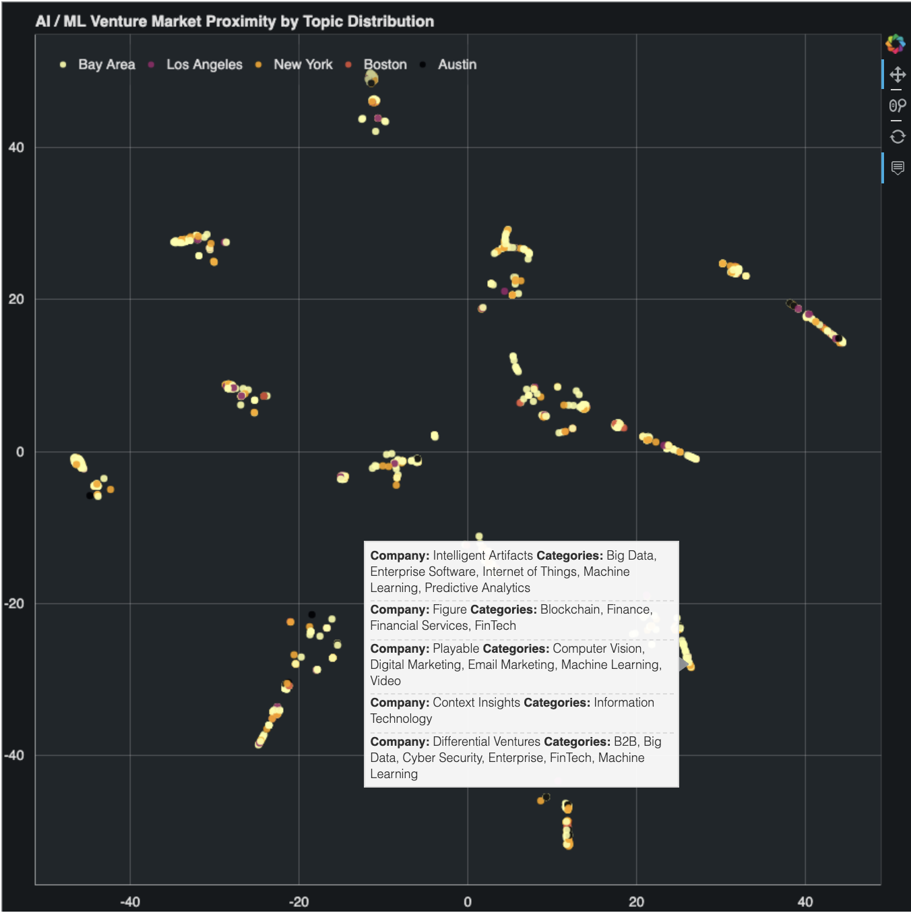

## Venture-Market-Proximity
[Try app on Heroku!](https://ai-ventures.herokuapp.com/)

This project's purpose was to investigate how Natural Language Processing (NLP) could be leveraged to discover insights that complement traditional market mapping. With data sourced from Crunchbase, NLP & Vectorization were to applied to company descriptions to establish and plot their relative market proximity.

### Process:
By necessity, language is inherently precise. Language is blunted by the regional, cultural, and creative variations we humans introduce over time. Thus, the most significant source of error is not dependence upon language itself, but rather on the writers to accurately articulate a venture firm's value proposition. To mitigate variance from inconsistent company descriptions, the stated market categories were added to this descriptive text in the pre-processing phase. Company names and repeated words were also removed from documents to reduce distortion.

### Data:
Startups on Crunchbase were filtered for those in the Artificial Intelligence & Machine Learning categories. All firms were founded within the past 3 years (8/25/2016) in the following 5 cities:

* San Francisco
* Los Angeles
* Austin
* Boston
* New York

### Technical:
Language preparation & processing utlized spaCy, NLTK, CountVectorizer, LDA, t-distributed Stochastic Neighbor Embedding (T-SNE), and TfidfVectorizer. The visualization was built using Bokeh running on Flask deployed with Heroku. 
